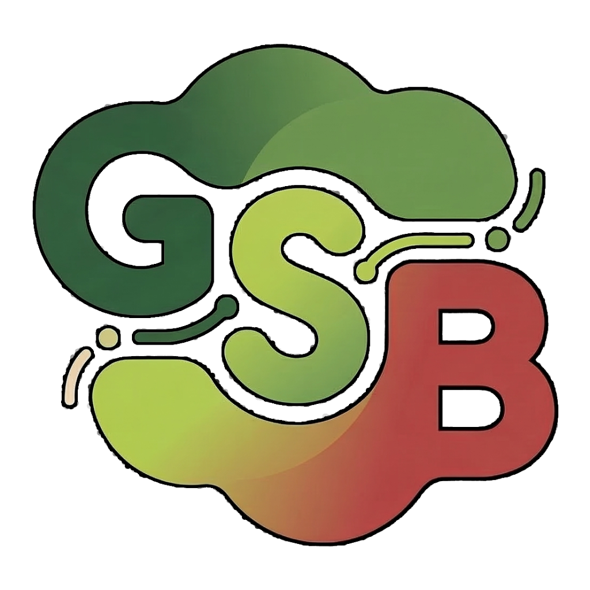

# Group Study Board

<p align="center">
  
</p>

Group Study Board is built around a simple idea: starting a study session with friends should take seconds, not minutes. No accounts, no sign-ups, no configuration — just open the site, create a room, share the link, and everyone is on the same whiteboard instantly.

---

## Tech Stack

| Layer     | Technology                                      |
|-----------|-------------------------------------------------|
| Backend   | Go 1.25, Gin, WebSockets   |
| Database  | MongoDB 8.0                                     |
| Frontend  | Angular 19, TypeScript                          |
| Styling   | Tailwind CSS                                    |
| Server    | Nginx (production static serving)               |
| Container | Docker, Docker Compose                          |

---

## Features

- **Real-time drawing** — strokes are broadcast to all participants with server-side ordering for consistency
- **Room system** — create or join rooms by ID; share a deep-link to invite others
- **Snapshots** — periodic MongoDB snapshots speed up late-joining participants
- **Rate limiting** — per-connection event throttling to prevent abuse

---

## Quick Start (Docker)

```bash
docker compose up --build
```

| Service  | URL                         |
|----------|-----------------------------|
| Frontend | http://localhost:4200       |
| Backend  | http://localhost:8080       |
| MongoDB  | mongodb://localhost:27017   |

---

## Manual Setup

### Backend (Go 1.25+)

```bash
cd backend
cp .env.example .env   # configure environment variables
go mod tidy
go run ./cmd/server
```

### Frontend (Node 24 LTS)

```bash
cd frontend
npm install
npm run start          # dev server at http://localhost:4200
```

---

## Project Structure

```
.
├── backend/
│   ├── cmd/server/     # Entry point
│   └── internal/       # Handlers, WebSocket hub, MongoDB store
├── frontend/
│   └── src/app/        # Angular component, canvas logic, WebSocket service
└── docker-compose.yml
```

---

## Notes

- This is an MVP so if you find any bugs, feel free to tell me.
- باقی جیو